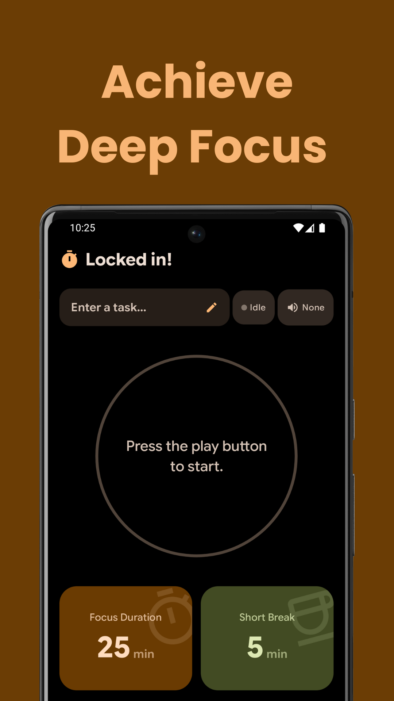
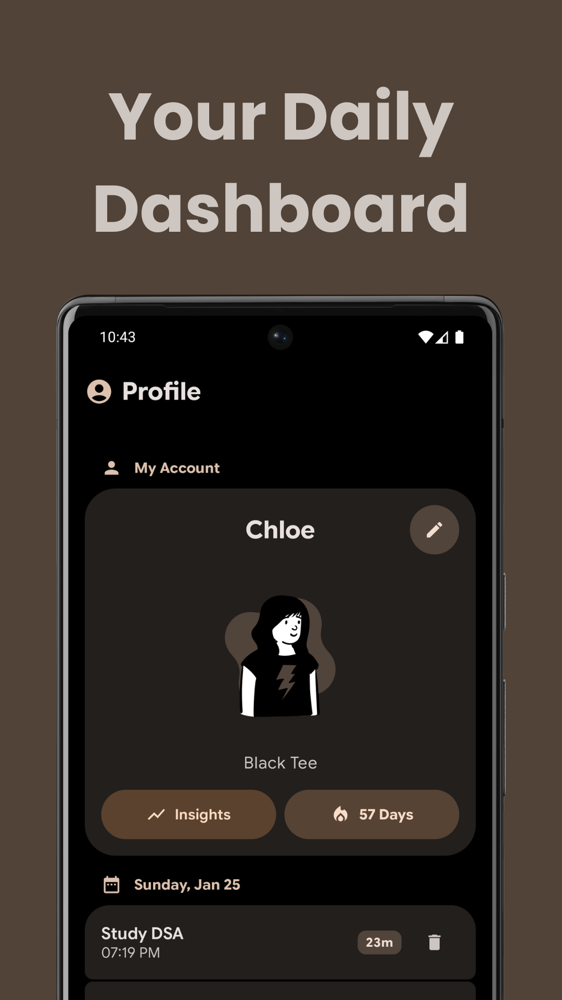

<div align="center">

# Sessions
### Your Personal Focus Companion

*Precision-engineered productivity application designed to help you master your time and maintain flow state.*

<p>
  <a href="YOUR_PLAYSTORE_LINK_HERE">
    
  </a>
  <a href="YOUR_GITHUB_LINK_HERE">
    
  </a>
  <a href="YOUR_IZZYONDROID_LINK_HERE">
    
  </a>
  <a href="YOUR_FDROID_LINK_HERE">
    
  </a>
</p>

<p>
  <a href="https://github.com/MohammadAliUstad/Sessions/releases">
    
  </a>
  <a href="https://github.com/MohammadAliUstad/Sessions/blob/main/LICENSE">
    
  </a>
  <a href="https://github.com/MohammadAliUstad/Sessions/issues">
    
  </a>
</p>

[Report Bug](https://github.com/MohammadAliUstad/Sessions/issues) · [Request Feature](https://github.com/MohammadAliUstad/Sessions/issues) · [Download Latest Release](https://github.com/MohammadAliUstad/Sessions/releases)

</div>

---

## 📖 Overview

Sessions transforms the concept of a simple timer into a comprehensive focus tool. Whether you're studying, coding, or writing, the application ensures your environment is optimized for concentration. It features a robust background service that prevents the operating system from killing the timer, ensuring your progress is tracked even when your phone is locked.

---

## ✨ Key Features

### 🎯 Intelligent Focus Engine
- **Customizable Cycles:** Define your exact Focus Duration, Break Duration, and Repetition count
- **Smart Intervals:** Automatically calculates when to trigger a Long Break based on your completed sets
- **Task History:** Assign names to specific sessions to recognize and review what you worked on later

### 🎵 Immersive Audio Environment
- **Curated Ambience:** Includes 5 high-quality background sounds: Rain, Brown Noise, Fireplace, Library, and Riverside
- **Adaptive Audio Ducking:** Background volume intelligently lowers during breaks and rises during focus sessions
- **Sensory Feedback:** Integrated haptic feedback and sound effects confirm interactions without visual confirmation

### 🔒 Reliability & System Integration
- **Persistent Notification:** Live notification on the lock screen allows you to track progress without unlocking
- **Background Stability:** Engineered to resist aggressive battery optimization

### 📊 Analytics & Personalization
- **Visual Insights:** Dedicated dashboard featuring heatmaps and metrics (Total Focus Time, Peak Productivity Hours)
- **Deep Theming:** 8 Color Themes (including Dynamic Material You), OLED Black Mode, and 6 Font options
- **Identity System:** Choose from a variety of avatars and set a custom display name

---

## 📱 Screenshots

<div align="center">

### Main Features

<table>
  <tr>
    <td align="center" width="33%">
      
      <br />
      <sub><b>Timer (Locked In)</b></sub>
    </td>
    <td align="center" width="33%">
      
      <br />
      <sub><b>Insights & Heatmap</b></sub>
    </td>
    <td align="center" width="33%">
      
      <br />
      <sub><b>Daily Dashboard</b></sub>
    </td>
  </tr>
</table>

### Customization & Settings

<table>
  <tr>
    <td align="center" width="25%">
      
      <br />
      <sub><b>Settings & Preferences</b></sub>
    </td>
    <td align="center" width="25%">
      
      <br />
      <sub><b>Appearance & Theming</b></sub>
    </td>
    <td align="center" width="25%">
      
      <br />
      <sub><b>Edit Profile</b></sub>
    </td>
    <td align="center" width="25%">
      
      <br />
      <sub><b>About Screen</b></sub>
    </td>
  </tr>
</table>

</div>

---

## 🏗️ Technical Architecture

Sessions is built using modern Android development standards, ensuring a codebase that is scalable, testable, and maintainable.

```
Language:           Kotlin
UI Framework:       Jetpack Compose (Material 3)
Architecture:       MVVM + Clean Architecture
Dependency Injection: Koin
Local Database:     Room
Backend Services:   Firebase (Auth, Firestore)
Concurrency:        Kotlin Coroutines & Flow
```

### Tech Stack
- **Kotlin** - Modern, concise, and safe programming language
- **Jetpack Compose** - Declarative UI toolkit for building native Android interfaces
- **Material 3** - Latest Material Design system for beautiful, accessible UIs
- **MVVM Architecture** - Separation of concerns for maintainable code
- **Room Database** - Robust local data persistence
- **Firebase** - Cloud services for authentication and data sync
- **Coroutines & Flow** - Asynchronous programming made simple

---

## 🚀 Setup & Installation

### Prerequisites
- Android Studio (latest version recommended)
- JDK 11 or higher
- Android SDK API 24+

### Steps

1. **Clone the Repository**
   ```bash
   git clone https://github.com/MohammadAliUstad/Sessions.git
   cd Sessions
   ```

2. **Firebase Configuration**
   - Create a project in the [Firebase Console](https://console.firebase.google.com/)
   - Download the `google-services.json` file
   - Place the file in the `app/` directory of the project

3. **Build & Run**
   - Open the project in Android Studio
   - Sync Gradle files
   - Select your target device/emulator
   - Click Run ▶️

---

## 🤝 Contributing

Contributions are what make the open source community such an amazing place to learn, inspire, and create. Any contributions you make are **greatly appreciated**.

1. Fork the Project
2. Create your Feature Branch (`git checkout -b feature/AmazingFeature`)
3. Commit your Changes (`git commit -m 'Add some AmazingFeature'`)
4. Push to the Branch (`git push origin feature/AmazingFeature`)
5. Open a Pull Request

---

## 📄 License

Distributed under the appropriate license. See `LICENSE` file for more information.

---

## 📧 Contact & Support

If you encounter any issues or have suggestions for future updates, please open an issue on GitHub or contact the developer directly.

**Developer:** Mohammad Ali Ustad  
**Email:** Mohammadaliustad@gmail.com  
**Company:** Yugen Tech

<div align="center">

### Show Your Support

If you find this project helpful, please consider giving it a ⭐!

</div>

---

<div align="center">
  <sub>Built with ❤️ by Yugen Tech</sub>
</div>
